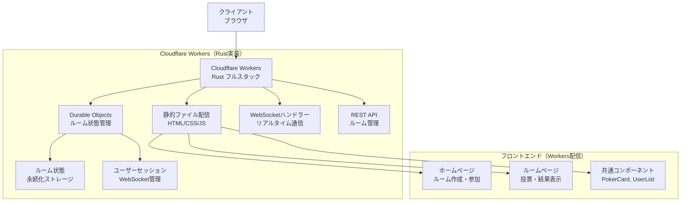
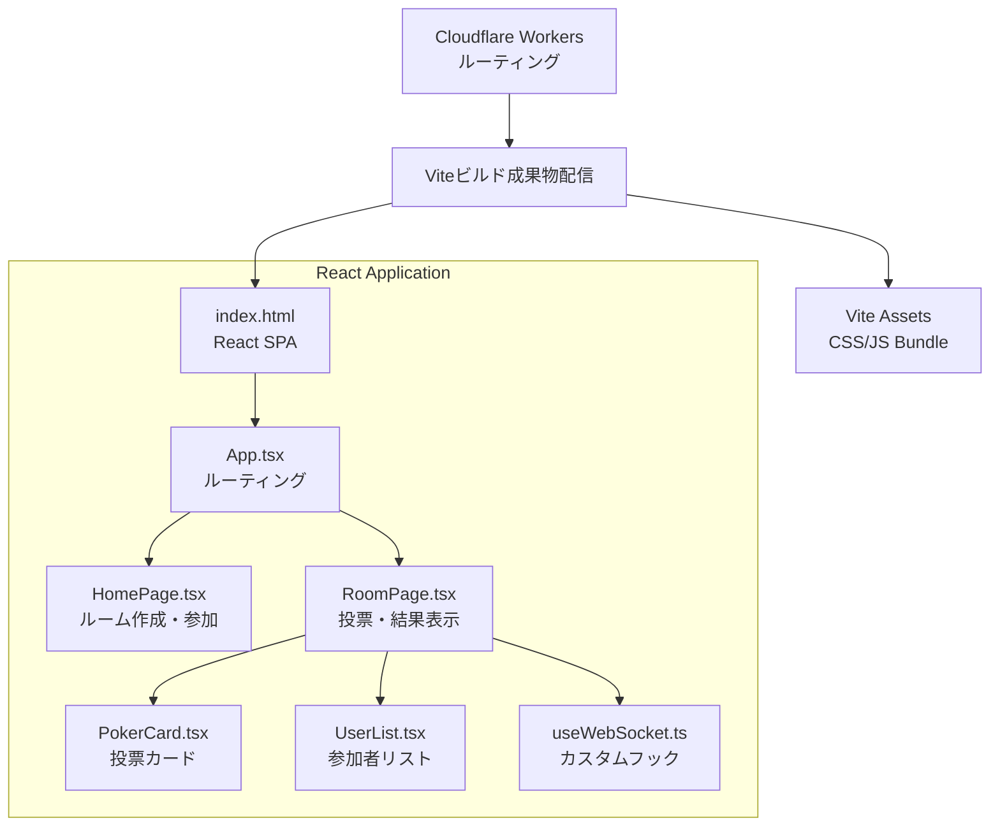
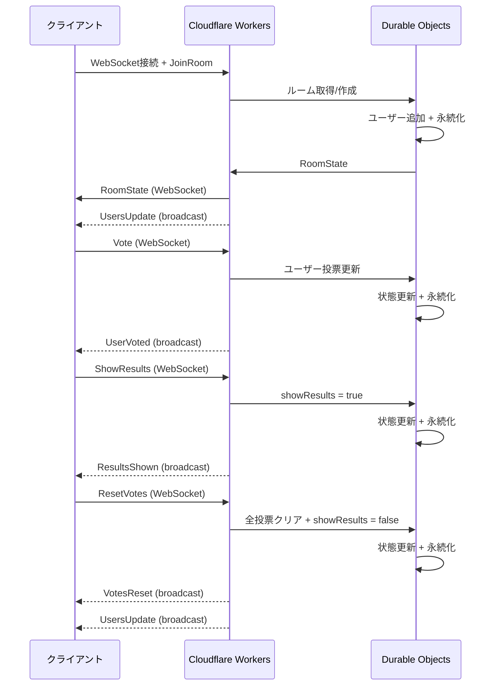

# 設計書

## 概要

スクラムポーカーアプリケーションは、フロントエンドにNext.js App Router、バックエンドにRust + Cloudflare Workersを採用したモダンなWebアプリケーションです。フロントエンドはReact + TypeScript + Tailwind CSSで構築され、バックエンドはCloudflare Workers WebSocket APIとDurable Objectsを使用したリアルタイム通信を提供します。Cloudflareのエッジネットワークにより、グローバルに高速でスケーラブルな動作を実現しています。

## アーキテクチャ

### システム全体構成



### 技術スタック

**フロントエンド:**
- React 19.1.1 - UIライブラリ
- Vite 6.0+ - 高速ビルドツール
- TypeScript 5.8.3 - 型安全性
- Tailwind CSS 3.4.17 - ユーティリティファーストCSS
- WebSocket API - ネイティブWebSocketクライアント

**バックエンド:**
- Rust - システムプログラミング言語
- Cloudflare Workers - サーバーレスランタイム
- Cloudflare Durable Objects - 状態管理とWebSocket処理
- worker-rs - Rust用Cloudflare Workers SDK
- serde - JSON シリアライゼーション

**インフラストラクチャ:**
- Cloudflare Workers - フルスタック（静的配信 + API + WebSocket）
- Cloudflare Durable Objects - 分散状態管理
- Cloudflare KV - 静的アセットキャッシュ（オプション）

**開発ツール:**
- Vite 6.0+ - 高速ビルドツールとHMR
- Biome - フロントエンドリンティング・フォーマッティング
- Cargo - Rustパッケージマネージャー
- Wrangler - Cloudflare Workers CLI

## コンポーネントとインターフェース

### フロントエンドコンポーネント構成



### 主要インターフェース

#### Rust データ構造
```rust
use serde::{Deserialize, Serialize};

#[derive(Serialize, Deserialize, Clone)]
pub struct User {
    pub id: String,           // WebSocketセッションID
    pub name: String,         // ユーザー名
    pub vote: Option<String>, // 投票値（未投票時はNone）
    pub is_spectator: Option<bool>, // 観戦者フラグ（将来拡張用）
}

#[derive(Serialize, Deserialize, Clone)]
pub struct Room {
    pub id: String,           // ルームID
    pub users: Vec<User>,     // 参加者リスト
    pub is_voting: bool,      // 投票中フラグ
    pub show_results: bool,   // 結果表示フラグ
}
```

#### WebSocketメッセージ
```rust
#[derive(Serialize, Deserialize)]
#[serde(tag = "type")]
pub enum ClientMessage {
    JoinRoom { room_id: String, user_name: String },
    Vote { room_id: String, vote: String },
    ShowResults { room_id: String },
    ResetVotes { room_id: String },
}

#[derive(Serialize, Deserialize)]
#[serde(tag = "type")]
pub enum ServerMessage {
    RoomState { room: Room },
    UsersUpdate { users: Vec<User> },
    UserJoined { user: User },
    UserLeft { user: User },
    UserVoted { user_id: String },
    ResultsShown { users: Vec<User> },
    VotesReset,
    Error { message: String },
}
```

#### TypeScript フロントエンド型定義
```typescript
// フロントエンド用の型定義（Rustの構造体と対応）
export interface User {
  id: string
  name: string
  vote?: string
  isSpectator?: boolean
}

export interface Room {
  id: string
  users: User[]
  isVoting: boolean
  showResults: boolean
}

export type ClientMessage = 
  | { type: 'JoinRoom', roomId: string, userName: string }
  | { type: 'Vote', roomId: string, vote: string }
  | { type: 'ShowResults', roomId: string }
  | { type: 'ResetVotes', roomId: string }

export type ServerMessage = 
  | { type: 'RoomState', room: Room }
  | { type: 'UsersUpdate', users: User[] }
  | { type: 'UserJoined', user: User }
  | { type: 'UserLeft', user: User }
  | { type: 'UserVoted', userId: string }
  | { type: 'ResultsShown', users: User[] }
  | { type: 'VotesReset' }
  | { type: 'Error', message: string }
```

#### React Router設定
```typescript
// App.tsx - React Router設定
import { BrowserRouter, Routes, Route } from 'react-router-dom'
import HomePage from './pages/HomePage'
import RoomPage from './pages/RoomPage'

export default function App() {
  return (
    <BrowserRouter>
      <Routes>
        <Route path="/" element={<HomePage />} />
        <Route path="/room/:id" element={<RoomPage />} />
      </Routes>
    </BrowserRouter>
  )
}
```

#### Rust 静的ファイル配信
```rust
// Cloudflare Workers内でViteビルド成果物を配信
use worker::*;

pub async fn handle_static_request(req: Request, ctx: RouteContext<()>) -> Result<Response> {
    let path = req.path();
    
    // SPAルーティング: すべてのHTMLリクエストをindex.htmlに
    if path == "/" || path.starts_with("/room/") {
        return serve_spa_index().await;
    }
    
    // 静的アセット配信
    match path {
        path if path.starts_with("/assets/") => serve_static_asset(path).await,
        "/vite.svg" | "/favicon.ico" => serve_static_asset(path).await,
        _ => Response::error("Not Found", 404)
    }
}

async fn serve_spa_index() -> Result<Response> {
    // Viteでビルドされたindex.htmlを配信
    let html = include_str!("../frontend/dist/index.html");
    Response::from_html(html)
}
```

### コンポーネント詳細設計

#### PokerCard React コンポーネント
```typescript
interface PokerCardProps {
  value: string
  selected: boolean
  onClick: () => void
  disabled: boolean
}

export default function PokerCard({ value, selected, onClick, disabled }: PokerCardProps) {
  return (
    <button
      type="button"
      onClick={onClick}
      disabled={disabled}
      className={`
        relative w-full aspect-[2/3] rounded-lg border-2 transition-all duration-200
        ${selected 
          ? 'border-blue-500 bg-blue-50 scale-105 shadow-lg' 
          : 'border-gray-300 bg-white hover:border-gray-400 hover:shadow-md'
        }
        ${disabled ? 'cursor-not-allowed opacity-50' : 'cursor-pointer'}
        flex items-center justify-center
      `}
    >
      <span className={`text-3xl font-bold ${selected ? 'text-blue-600' : 'text-gray-700'}`}>
        {value}
      </span>
    </button>
  )
}
```

#### UserList React コンポーネント
```typescript
interface UserListProps {
  users: User[]
  votedUsers: Set<string>
  showResults: boolean
  currentUserId?: string
}

export default function UserList({ users, votedUsers, showResults, currentUserId }: UserListProps) {
  const calculateStats = () => {
    const numericVotes = users
      .filter(u => u.vote && u.vote !== '?')
      .map(u => parseInt(u.vote!))
    
    if (numericVotes.length === 0) return { avg: '-', max: '-', min: '-' }
    
    return {
      avg: (numericVotes.reduce((sum, vote) => sum + vote, 0) / numericVotes.length).toFixed(1),
      max: Math.max(...numericVotes).toString(),
      min: Math.min(...numericVotes).toString()
    }
  }

  const stats = calculateStats()

  return (
    <div className="bg-white rounded-lg shadow-md p-6">
      {/* ユーザーリスト表示 */}
      {/* 統計情報表示 */}
    </div>
  )
}
```

#### useWebSocket カスタムフック
```typescript
export function useWebSocket(url: string) {
  const [socket, setSocket] = useState<WebSocket | null>(null)
  const [connectionState, setConnectionState] = useState<'connecting' | 'connected' | 'disconnected'>('disconnected')
  const messageHandlers = useRef<Map<string, (data: any) => void>>(new Map())

  const connect = useCallback(() => {
    const ws = new WebSocket(url)
    
    ws.onopen = () => {
      setConnectionState('connected')
      setSocket(ws)
    }
    
    ws.onmessage = (event) => {
      const message = JSON.parse(event.data) as ServerMessage
      const handler = messageHandlers.current.get(message.type)
      if (handler) handler(message)
    }
    
    ws.onclose = () => {
      setConnectionState('disconnected')
      setSocket(null)
      // 自動再接続ロジック
    }
  }, [url])

  const sendMessage = useCallback((message: ClientMessage) => {
    if (socket?.readyState === WebSocket.OPEN) {
      socket.send(JSON.stringify(message))
    }
  }, [socket])

  const onMessage = useCallback((type: string, handler: (data: any) => void) => {
    messageHandlers.current.set(type, handler)
  }, [])

  return { connect, sendMessage, onMessage, connectionState }
}
```

## データモデル

### Durable Objects ストレージ構造

```rust
// Durable Object内の状態管理
pub struct RoomDurableObject {
    state: DurableObjectState,
    room: Room,
    websockets: HashMap<String, WebSocket>, // ユーザーID -> WebSocket接続
}

impl RoomDurableObject {
    // ルーム状態の永続化
    async fn persist_room(&mut self) -> Result<(), Error> {
        self.state.storage()
            .put("room", &self.room)
            .await
    }
    
    // WebSocket接続の管理
    async fn add_websocket(&mut self, user_id: String, ws: WebSocket) {
        self.websockets.insert(user_id, ws);
    }
    
    // 全参加者への一斉送信
    async fn broadcast(&self, message: &ServerMessage) {
        for ws in self.websockets.values() {
            let _ = ws.send(&serde_json::to_string(message).unwrap()).await;
        }
    }
}

// ルームデータ構造例
Room {
    id: "abc123".to_string(),     // ランダム生成されたルームID
    users: vec![                  // 参加者ベクター
        User {
            id: "ws_conn_1".to_string(), // WebSocket接続ID
            name: "田中".to_string(),     // ユーザー入力名
            vote: Some("5".to_string()),  // 選択された投票値
            is_spectator: None,
        }
    ],
    is_voting: false,             // 現在未使用（将来拡張用）
    show_results: true,           // 結果表示状態
}
```

### データフロー



## エラーハンドリング

### フロントエンドエラーハンドリング

1. **入力検証エラー**
   - 名前未入力時のアラート表示
   - ルームID未入力時のアラート表示

2. **WebSocket接続エラー**
   - 接続失敗時の自動再接続
   - 接続状態の監視とユーザーフィードバック
   - Cloudflare Workers接続エラーの適切な処理

3. **状態不整合エラー**
   - 結果表示中の投票無効化
   - 未投票時の結果表示ボタン無効化
   - サーバーエラーメッセージの表示

### バックエンドエラーハンドリング

1. **WebSocket接続管理**
   - 切断時のユーザー削除とDurable Objects状態更新
   - 空ルームの自動削除（Durable Objects自動ガベージコレクション）
   - 不正なルームIDへの対応とエラーレスポンス

2. **データ整合性**
   - 存在しないルームへのアクセス防止
   - 重複ユーザーIDの処理
   - Durable Objects状態の整合性保証

3. **Cloudflare Workers制限対応**
   - CPU時間制限（10ms）の考慮
   - メモリ制限（128MB）の管理
   - WebSocket接続数制限の処理

## テスト戦略

### 単体テスト対象

1. **ユーティリティ関数**
   - 統計計算関数（平均、最高、最低）
   - ルームID生成ロジック

2. **コンポーネントテスト**
   - PokerCard の選択状態表示
   - UserList の統計計算表示

### 結合テスト対象

1. **Socket.IOイベントフロー**
   - ルーム参加 → 投票 → 結果表示 → リセット
   - 複数ユーザーでの同期動作

2. **UI操作フロー**
   - ルーム作成から投票完了まで
   - レスポンシブデザインの動作確認

### E2Eテスト対象

1. **基本フロー**
   - ルーム作成 → 参加 → 投票 → 結果確認
   - 複数ブラウザでの同期確認

2. **エラーケース**
   - 不正入力時の動作
   - ネットワーク切断時の復旧

## パフォーマンス考慮事項

### フロントエンド最適化

1. **React最適化**
   - useCallback/useMemoの適切な使用
   - 不要な再レンダリングの防止

2. **バンドルサイズ最適化**
   - Next.js自動最適化の活用
   - 動的インポートの検討

### バックエンド最適化

1. **Cloudflare Workers最適化**
   - 効率的なRust実装によるCPU使用量削減
   - Durable Objects状態の最小化
   - WebSocket接続の効率的な管理

2. **Durable Objects最適化**
   - 適切なルーム分離（1ルーム = 1 Durable Object）
   - 不要なブロードキャスト削減
   - 状態永続化の最適化（必要時のみ）

3. **エッジ最適化**
   - Cloudflareエッジネットワークによる低レイテンシ
   - 地理的に分散したDurable Objects配置

## セキュリティ考慮事項

### 入力検証

1. **クライアント側検証**
   - 名前・ルームIDの形式チェック
   - 投票値の妥当性検証

2. **サーバー側検証**
   - Socket.IOイベントデータの検証
   - ルームアクセス権限の確認

### CORS設定

- 開発環境: localhost:3000のみ許可
- 本番環境: 特定ドメインのみ許可

## 運用考慮事項

### ログ出力

- ユーザー接続・切断ログ
- エラー発生時の詳細ログ

### 監視項目

- 同時接続ユーザー数
- アクティブルーム数
- メモリ使用量

### スケーラビリティ

Cloudflare Workersプラットフォームによる自動スケーリング設計：

1. **自動スケーリング**
   - Cloudflare Workers自動スケーリング（リクエスト量に応じて）
   - Durable Objects自動分散配置
   - エッジロケーション間での負荷分散

2. **将来的な拡張**
   - Cloudflare R2による大容量データストレージ
   - Cloudflare D1による構造化データ管理
   - Cloudflare Analyticsによる詳細監視

3. **コスト効率**
   - 使用量ベースの課金モデル
   - サーバー管理不要
   - 自動的なグローバル配信